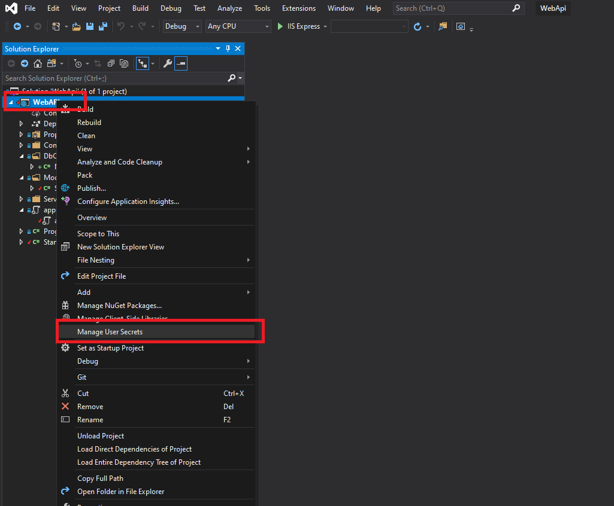

# db-backend Repository readme

### How to set up Secrets.json (**REQUIRED** to get the backend to work)
 

1. Right click on the *WebAPI.csproj* (Project), and click on *Manage User Secrets*
    - 
    - It should open up secrets.json, which is an empty JSON file

2. Populate secrets.json with the PostGreSQL DB Connection String in the following format:

    `{`\
    &nbsp;&nbsp;&nbsp;&nbsp;`"DbConnectionString": "Server=???;Database=???;User Id=???;Password=???;Port=???"`\
    `}`

    - Note that DbConnectionString's value's fields **MUST** be filled out properly - the actual string will be sent in Slack by Allison.
3. If you run the application in IIS Express, you should be able to test the different API routes, which use the PostGreSQL DB
